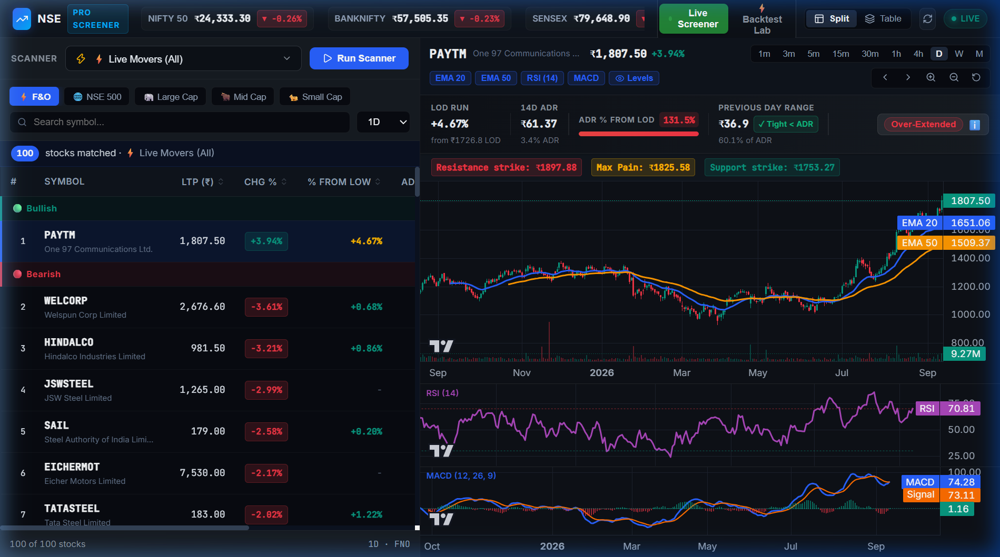
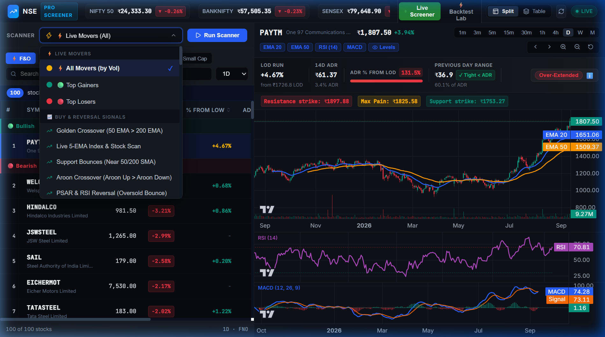
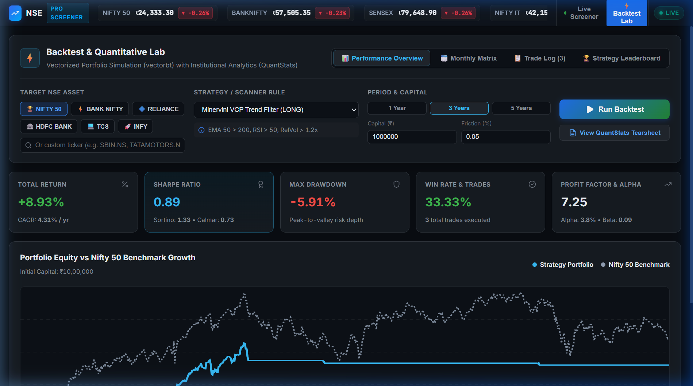
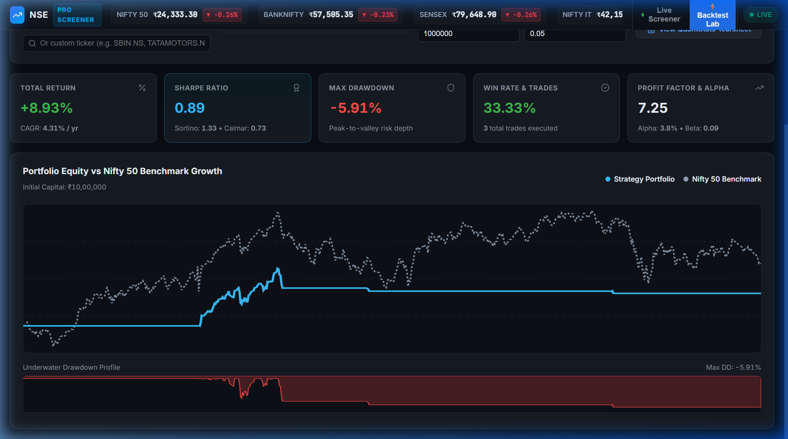

# 📈 NSE Stock Screener & Quantitative Terminal

> An institutional-grade, real-time Indian stock screener (NSE/BSE) featuring live TradingView indicators, Indian market ADR volatility extension gauges, 32 PKScreener momentum algorithms, Minervini VCP pattern detection, multi-pane Lightweight Charts v5, and a full VectorBT + QuantStats quantitative backtesting lab.

[](http://127.0.0.1:8009/docs)
[](http://localhost:5180)
[](https://tradingview.github.io/lightweight-charts/)
[](https://vectorbt.dev/)
[](#architecture)
[](#setup--quickstart)

---

## 📸 Platform Screenshots

### 1. Real-Time Screener, Multi-Pane Chart & Indian Market ADR Gauge
*Live stock scanner table with `% From Low` and `ADR Used` metrics, multi-indicator chart (Candlesticks, Volume, EMA 20/50, RSI 14, MACD, Strike Levels), and the expanded **Indian Market Context & Risk Assessment** banner.*



---

### 2. Universal Categorized Scanner Rules Dropdown
*Instant access to Live Movers, Buy & Reversal Signals, PKScreener Momentum Algorithms, Minervini VCP Patterns, RRG Relative Rotation, and the new **ADR Expansion** setup finder.*



---

### 3. Quantitative Backtesting Lab & Performance Overview
*Vectorized simulation suite powered by **VectorBT** and **QuantStats** showing cumulative returns, Sharpe ratio, Win Rate, Profit Factor, Alpha, and monthly returns heatmap.*



---

### 4. Portfolio Equity Growth & Underwater Drawdown Profiles
*High-resolution equity curve benchmarked directly against NIFTY 50 alongside drawdown depth and recovery timeframes.*



---

## 🌟 Core Features

### 🇮🇳 1. Indian Market ADR & Intraday Range Extension
Tailored specifically for Indian equities where high retail participation, high ADRs (4%–10%+), and SEBI circuit limits (5%, 10%, 20%) can suddenly cap breakouts:

- **% Change from Low (LOD)**:
  $$\left( \frac{\text{Current Price} - \text{LOD}}{\text{LOD}} \right) \times 100$$
  *Identifies early reversals vs. late-chasing breakouts.*
- **ADR % from LOD (Dynamic Gauge Bar)**:
  $$\left( \frac{\text{Current Price} - \text{LOD}}{\text{14-Day ADR (₹)}} \right) \times 100$$
  - **🟢 Early Expansion ($<40\%$)**: Favorable entry; tight stop to LOD in rupee terms.
  - **🟡 Active Momentum ($40\% - 70\%$)**: Expansion underway; trail stops closely.
  - **🔴 Over-Extended ($>70\%$)**: Late entry alert; statistically poor risk/reward with elevated pullback risk.
- **Previous-Day Range < ADR Check**:
  $$\text{Yesterday's Range } (High_{prev} - Low_{prev}) < 14\text{D ADR}$$
  - `✓ Tight < ADR`: Prior day volatility contraction preceding explosive moves.
  - `⚠ Wide ≥ ADR`: Prior day volatility expansion indicating potential consolidation today.
- **Indian Market Context Advisory Card**: Contextual guidance on circuit limit caps and logical stop placement.

---

### 🔍 2. Universal Scanner Framework
- **⚡ Live Movers**: Top Gainers, Top Losers, and Volume Shockers.
- **🎯 ADR Contraction & Expansion**: Screen stocks initiating expansion after tight prior sessions.
- **📈 32 PKScreener Algorithmic Scans**:
  - *Bullish / Reversals*: Golden Cross (50/200), 5-EMA Intraday Reversal, RSI Range Shift, Bullish Engulfing, Morning Star, Support Bounce, PSAR Bullish Flip, Aroon Up Trend.
  - *Bearish / Breakdowns*: Death Cross, EMA 20/50 Crossunder, Overbought RSI Climax, Bearish Engulfing, Breakdown through Support.
  - *Volume & Breakouts*: Volume Shockers (>3x average), Consolidation Breakouts, 52-Week High Breakouts.
- **🔺 Mark Minervini VCP Patterns**: Multi-stage contraction detection ($2T, 3T, 4T$) coupled with Mark Minervini's 8-point Trend Template criteria.
- **🔄 RRG Relative Rotation**: Sector and stock momentum ranking (*Leading, Improving, Weakening, Lagging*) benchmarked to NIFTY 50.
- **⚖️ Key Option Strike Levels**: Automated calculations for Immediate Support, Resistance, and Max Pain strikes.

---

### 📊 3. Interactive Charting (Lightweight Charts v5)
- Multi-pane synchronized charting engine:
  - **Main Chart**: Candlesticks, Volume Histogram, EMA 20, EMA 50, Strike Levels.
  - **Sub-Chart 1**: RSI (14) with overbought (70) and oversold (30) reference lines.
  - **Sub-Chart 2**: MACD Level, Signal Line, and zero-centered Histogram.
- Full timeframe support: `5m`, `15m`, `30m`, `1H`, `4H`, `1D`, `1WK`, `1MO`.
- Intelligent symbol resolution: Automatic `.NS` / `.BO` routing and index mapping (`^NSEI`, `^NSEBANK`, `^BSESN`).

---

### 🧪 4. Quantitative Backtesting Lab (VectorBT + QuantStats)
- **Vectorized Backtests**: Fast multi-year simulations with realistic trading fees (0.05%) and slippage (0.05%).
- **Interactive Metric Cards**: Total Return, Benchmark Return, Sharpe Ratio, Sortino Ratio, Max Drawdown, Calmar Ratio, Profit Factor, and Alpha.
- **QuantStats HTML Tearsheets**: Embedded standalone tearsheets featuring monthly returns heatmaps, rolling volatility, and Monte Carlo drawdowns.

---

### ⚡ 5. Real-Time Option Chain & Greeks Ladder
- **Pure-Python Analytical Black-Scholes Greeks**: Delta ($\Delta$), Gamma ($\Gamma$), Theta ($\Theta$), and Vega ($\mathcal{V}$) for liquid weekly/monthly NSE strikes.
- **Max Pain & Put-Call Ratio (PCR)**: Dynamic strike solver pinpointing maximum option buyer expiration loss and total/strike PCR sentiment.
- **Implied Volatility (IV) Analytics**: Newton-Raphson numerical solver, 30-day Historical Volatility (HV), IV Rank (IVR), and IV Percentile (IVP).
- **Interactive Strike Ladder**: Visual Call/Put OI magnitude bars, ATM highlight badges, and 1-click execution routing.

---

### 🔔 6. Real-Time Alerts & Multi-Channel Webhooks
- **Background Evaluation Engine**: Periodic market-hours scheduler checking active triggers with 15-minute anti-spam cooldowns.
- **Telegram Bot Dispatcher**: Automated trade signals formatted in Markdown with price, ADR % from LOD, and chart link.
- **Discord Webhooks**: Rich embed cards with color-coded severity (Green = Breakout, Red = Breakdown, Orange = ADR Climax).
- **Desktop Push Notifications**: HTML5 Notifications API integration for native OS alerts.

---

### 💼 7. Paper Trading & Broker Integration (Dhan HQ)
- **Zero-Risk Paper Trading**: Simulated ₹1,000,000 portfolio with 0.05% slippage, exchange fees, and live Mark-to-Market (MTM) P&L tracking.
- **Dhan HQ Open API v2 Adapter**: Live order placement (Regular, Intraday MIS, Delivery CNC, SL/SL-M) and margin inquiry.
- **Trading Desk UI**: Quick-order drawer directly on chart and screener rows with 1-click "Square Off All" safety control.

---

## 🏛️ Architecture & Data Flow

```
Browser (React + Vite :5180)
      │
      ▼ [/api/* proxy]
FastAPI Backend (:8009)
      ├── tvscreener (TradingView API) ──► Live Indicators & Real-time Prices
      ├── yfinance                     ──► Candlestick OHLCV & Backtesting Data
      └── SQLite (scanner.db)          ──► Saved Scans, OHLCV Cache & Range Stats
```

| Component | Responsibility | Key File |
|-----------|----------------|----------|
| **API Layer** | FastAPI endpoints & request validation | [backend/main.py](backend/main.py) |
| **Live Engine** | TradingView live screener data & ADR metrics | [backend/tvscreener_service.py](backend/tvscreener_service.py) |
| **OHLCV Engine** | yfinance historical data, cache & ADR stats | [backend/ohlcv_service.py](backend/ohlcv_service.py) |
| **Scanner Registry** | Universal dispatch for all scanner types | [backend/scanner_registry.py](backend/scanner_registry.py) |
| **Pattern Engine** | Minervini VCP pattern recognition | [backend/vcp_service.py](backend/vcp_service.py) |
| **Backtest Engine**| VectorBT simulation & QuantStats reporting | [backend/backtest/engine.py](backend/backtest/engine.py) |
| **Frontend App** | UI layout, active state & view switching | [frontend/src/App.jsx](frontend/src/App.jsx) |
| **Chart Component**| Multi-pane lightweight-charts v5 & ADR bar | [frontend/src/components/ChartPanel.jsx](frontend/src/components/ChartPanel.jsx) |
| **Scanner Panel** | Filter controls, stock table & sort handlers | [frontend/src/components/ScannerPanel.jsx](frontend/src/components/ScannerPanel.jsx) |

---

## ⚙️ Setup & Quickstart

### Prerequisites
- **Python**: 3.11 or newer
- **Node.js**: 18 or newer

### 1. Clone the Repository
```bash
git clone https://github.com/piyushk20/screenerpython.git
cd screenerpython
```

### 2. Backend Setup
```bash
# Create and activate virtual environment
python -m venv .venv
.venv\Scripts\activate      # Windows (PowerShell/cmd)
# source .venv/bin/activate # macOS/Linux

# Install backend dependencies
pip install -r requirements.txt

# Start FastAPI backend
python -m uvicorn backend.main:app --host 127.0.0.1 --port 8009
```

### 3. Frontend Setup
In a separate terminal window:
```bash
cd frontend
npm install
npm run dev
```

### 4. Access the Application
- **Terminal Web App**: [http://localhost:5180](http://localhost:5180)
- **Backend Health Check**: [http://127.0.0.1:8009/health](http://127.0.0.1:8009/health)
- **Interactive Swagger Docs**: [http://127.0.0.1:8009/docs](http://127.0.0.1:8009/docs)

---

## 📚 Further Documentation
- **[TODO.md](TODO.md)**: Detailed feature roadmap, completed milestones, and upcoming developments.
- **[ABOUT.md](ABOUT.md)**: Deep dive into the project vision, market microstructures, and ADR trading philosophy.

---

## 📄 License
MIT License. Built for Indian quantitative and technical market research.
